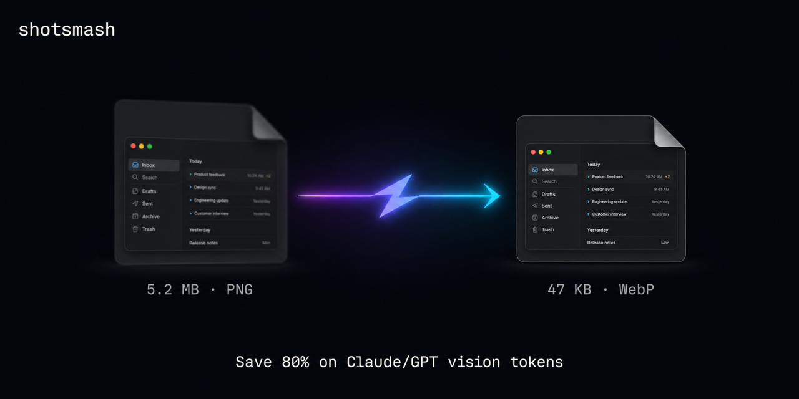
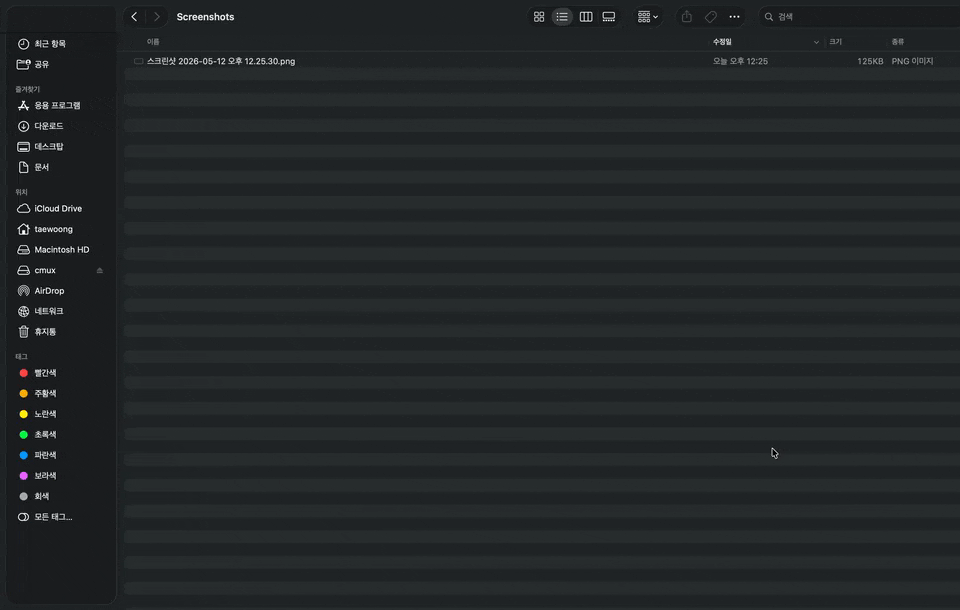

# shotsmash



> Stop bleeding vision tokens every time you paste a screenshot into Claude Code, Cursor, or Codex. Every macOS screenshot you take is auto-converted to a small WebP — typically **80–95% smaller**, identical visual quality.

```
5,177 KB PNG  →  350 KB WebP   (-94%)
  487 KB PNG  →   54 KB WebP   (-89%)
  127 KB PNG  →   46 KB WebP   (-64%)
```

No new shortcut to learn. Press `Cmd+Shift+4` like always. shotsmash handles the rest in the background.

### See it in action



The moment you hit `Cmd+Shift+4`, the file lands as a 125 KB PNG — then shotsmash silently swaps it for a 14 KB WebP. Same screenshot. Same visual content. **9× smaller.**

## Install

```sh
curl -fsSL https://raw.githubusercontent.com/Taewoong1378/shotsmash/main/install.sh | bash
```

That's it. It will:

1. Install `webp` via Homebrew if missing
2. Move your screenshot save location to `~/Pictures/Screenshots/` (avoids macOS Full Disk Access prompts)
3. Install a launchd agent that watches the folder + polls every 30 s
4. Drop a config stub at `~/.config/shotsmash/config.sh`

Then take a screenshot. Check `~/Pictures/Screenshots/` — your `.png` becomes `.webp` within a second.

## Why this exists

**Claude Code, Cursor, Codex CLI, Copilot Chat — none of them pre-compress your screenshots.** Every 5 MB Retina PNG you paste goes straight to the model, and the SOTA coding models charge per pixel. Claude Code's only built-in defense kicks in above 2,000 px [^claude-code-resize]; everything else gets sent raw.

### How much you save in your coding tool

Cost per image, paying out of pocket via API. Assumes a typical macOS Retina screenshot.

| Coding tool + model | Raw 3024×1890 PNG | shotsmash 1400×875 WebP | Savings |
|---|---|---|---|
| **Claude Code + Opus 4.7** | 4,784 tok · $0.024 | 1,634 tok · $0.008 | **−66%** |
| **Cursor + GPT-5.5** | 5,664 tok · $0.028 | 1,247 tok · $0.006 | **−78%** |
| **Codex CLI + GPT-5.5** | 5,664 tok · $0.028 | 1,247 tok · $0.006 | **−78%** |
| **Copilot Chat + GPT-5.5** | 5,664 tok · $0.028 | 1,247 tok · $0.006 | **−78%** |
| Claude Code + Sonnet 4.6 | 1,568 tok (capped) | 1,568 tok (capped) | tokens unchanged ¹ |
| Gemini 3.1 Pro (any tool) | 560 tok (flat) | 560 tok (flat) | tokens unchanged ¹ |

> 20 screenshots/day × 20 workdays = **400/month**. On Cursor + GPT-5.5 that's **$11.33 → $2.49** out of pocket. For a 10-person team: **~$1,060/year saved**. [^anthropic-vision] [^openai-vision] [^pricing]

¹ Sonnet 4.6 / Haiku 4.5 cap at 1,568 image tokens. Gemini charges a flat 560/image. In those cases per-image **token** cost doesn't change — but you still get (a) 99% faster uploads (5 MB → 50 KB), (b) automatic protection when Cursor's Auto mode routes you to Opus 4.7, where image tokens triple [^opus-3x].

[^claude-code-resize]: Claude Code only auto-downscales images over 2,000 px (since v2.1.126). Anything 1,400–2,000 px is sent raw. [github.com/anthropics/claude-code#20738](https://github.com/anthropics/claude-code/issues/20738)
[^anthropic-vision]: Claude vision token formula `width × height / 750`, capped at 1,568 tokens for Sonnet/Haiku and 4,784 for Opus 4.7 (long edge ≤2576 px). [Anthropic vision docs](https://platform.claude.com/docs/en/build-with-claude/vision)
[^openai-vision]: GPT-5/5.5 uses 32×32 pixel patches: `ceil(w/32) × ceil(h/32)` tokens. [OpenAI vision guide](https://developers.openai.com/api/docs/guides/images-vision)
[^pricing]: [Anthropic pricing](https://platform.claude.com/docs/en/about-claude/pricing) · [OpenAI pricing](https://developers.openai.com/api/docs/pricing) · [Gemini pricing](https://ai.google.dev/gemini-api/docs/pricing)
[^opus-3x]: Opus 4.7 raised the per-image token ceiling to ~4,784 (from ~1,568), a 3× jump. [claudecodecamp.com](https://www.claudecodecamp.com/p/images-cost-3x-more-tokens-in-claude-opus-4-7)

## How it compares

| | shotsmash | [LLM Image Optimizer](https://www.image-optimizer.app/) | CleanShot X | ImageOptim | Folder Action scripts |
|---|:-:|:-:|:-:|:-:|:-:|
| Auto-process every screenshot | ✅ | ✅ (own shortcut) | ⚠️ partial | ❌ | ✅ |
| Keep native `Cmd+Shift+4` | ✅ | ❌ | ✅ ¹ | n/a | ✅ |
| WebP output | ✅ | ✅ | ✅ (v4.8+) | ❌ | DIY |
| Resize | ✅ | ✅ | ✅ | ❌ | DIY |
| AI-token-aware defaults | ✅ | ✅ | ❌ | ❌ | ❌ |
| Native macOS (no Electron) | ✅ | ❓ ² | ✅ | ✅ | ✅ |
| Free / open source | ✅ | Freemium ³ | $29 + $8/mo ⁴ | ✅ | ✅ |

<sub>¹ Default keeps system shortcuts; CleanShot can override them as an opt-in setting. &nbsp; ² Marketed as "Apple Silicon native" but framework (Swift / Electron) not publicly confirmed. &nbsp; ³ 100 images/mo free, £19.99/yr Pro, £59.99 lifetime. &nbsp; ⁴ $29 one-time (app + Cloud Basic). Cloud Pro $8/mo billed annually.</sub>

## Configuration

Edit `~/.config/shotsmash/config.sh`:

```sh
MAX_DIM=1400              # Long-side max in pixels
QUALITY=78                # WebP quality (1-100)
OUTPUT_FORMAT="webp"      # "webp" or "jpg"
KEEP_ORIGINALS=true       # Back up originals before processing
ORIGINAL_RETENTION_DAYS=7
```

Or set the env vars in the LaunchAgent plist if you want them to apply to the background process.

## Safety

- Originals are copied to `~/.shotsmash/originals/` before any change (kept 7 days, configurable).
- Each processed file gets a `com.shotsmash.processed` xattr so it's never reprocessed.
- The agent only touches files matching macOS screenshot naming patterns. Other images in the folder are untouched.

## Uninstall

```sh
curl -fsSL https://raw.githubusercontent.com/Taewoong1378/shotsmash/main/uninstall.sh | bash
```

## License

MIT
